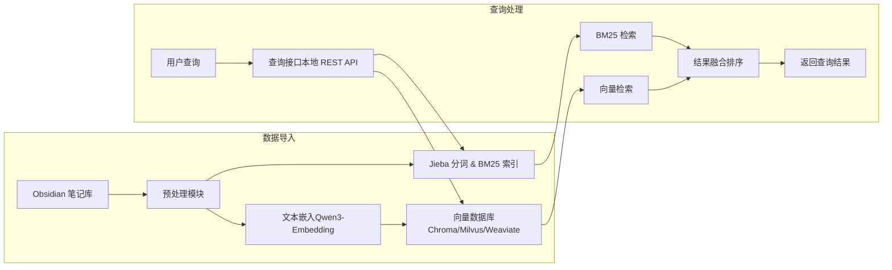

# 执行摘要

本设计旨在构建一个基于本地 Obsidian 笔记的中文向量知识库，利用 Qwen3-Embedding-0.6B 模型生成文本向量，并结合 jieba 中文分词和 BM25 倒排索引实现混合检索【2†L142-L149】【32†L125-L134】。系统包括笔记导入与预处理、中文分词+BM25 索引、Qwen3 嵌入生成与向量存储、检索融合和本地查询 API 等关键模块。我们详细规划了组件清单、数据流程和接口定义，并提供了 Windows/macOS 平台下的部署方案（支持 Docker 和 Python 本地环境），涵盖依赖、版本、性能估算、备份与安全策略、测试验证与常见故障排查等内容。下文以架构图和流程图形式说明系统结构，并通过代码示例和表格罗列推荐开源工具及版本，实现完整可执行的设计实施文档。

## 系统架构

系统整体架构分为**数据导入**和**查询处理**两大部分，如下图所示：Obsidian 笔记库数据先经预处理模块输出纯文本和元数据，然后分别进入 BM25 索引和向量嵌入流程；查询通过本地 API 同时触发 BM25 检索和向量相似度检索，最后融合排序返回结果。  



### 组件清单

- **Obsidian 笔记库**：使用 Markdown 格式文件，包含 YAML frontmatter（如标题、标签、日期等）和正文内容。笔记可能包括图片附件。  
- **预处理模块**：解析 Markdown，提取纯文本和元数据。移除 Markdown 语法（标题、列表、引用、代码块等），处理内部链接。  
- **中文分词与 BM25 索引**：基于 jieba 对正文进行分词，建立 BM25 倒排索引。索引字段包括标题、正文、标签等。可扩展停用词表和自定义词典。  
- **向量化模块**：加载 Qwen3-Embedding-0.6B 模型（支持最大 32K token 上下文和≤1024 维输出【2†L142-L149】），对文本生成向量。支持批量处理、量化（如 GGUF/INT8）和加速（GPU 或 Intel OpenVINO【8†L85-L94】）。  
- **向量数据库**：存储文档向量和元数据的系统，如 Milvus、Weaviate、FAISS、Chroma 等。负责创建向量集合、建索引（IVF、HNSW 等）、支持持久化和高效检索。  
- **查询接口**：本地 RESTful (或 gRPC) 服务（可用 FastAPI/Flask 实现），接收查询请求，调用检索模块并返回 JSON 结果。例如 `/search` 接口接受查询文本和参数，返回文档ID、匹配得分和文本片段。  
- **监控与管理**：日志、性能监控、定期备份脚本、安全控制策略等辅助组件。  

### 数据流程

1. **笔记导入**：遍历 Obsidian Vault 目录，使用 YAML 前端的元数据（如 `title`、`tags`）初始化文档字段。推荐使用 [`obsidianmd-parser`](https://pypi.org/project/obsidianmd-parser/) 库加载 Vault，并访问每篇 Note 的 `frontmatter`、`content`、`tags`、`wikilinks` 等属性【29†L117-L125】。  
2. **预处理**：对每个 Markdown 文本进行清洗和分段，如去除标题符号、列表标记、表格语法、任务符、代码块等。内部 Wikilink（`[[...]]`）可转换为普通文本或记录为相关文档。  
   - **标签与 Wiki 链接处理**：提取 YAML frontmatter 中的标签（`tags` 字段），以及正文中的 `#标签` 和双括号链接。例如，使用正则 `re.findall(r"#(\\w+)", text)` 捕获标签，`re.findall(r"\\[\\[(.*?)\\]\\]", text)` 捕获 Wiki 链接；或直接使用 obsidianmd-parser 的 `note.tags` 和 `note.wikilinks`。将这些信息作为独立元数据字段存储，可在索引时为 `tags` 字段赋予更高权重，或在查询时作过滤。【29†L117-L125】  
3. **分词与索引**：对预处理后的纯文本和元数据进行分词。加载 jieba 自定义词典和停用词表以优化分词效果。将文档拆分为标题词、正文词、标签词等，并记录每词的词频和文档频率，构建 BM25 倒排索引。为不同字段设置权重（例如标题/标签高于正文）。倒排表结构类似 `{token: [(doc_id, freq), ...]}`，便于快速检索计算 BM25 分数。  
4. **向量生成**：将处理后的文档文本送入 Qwen3-Embedding-0.6B 模型。由于支持 32K 最大长度，可以处理长文档；超过长度时需拆分并合并向量。示例：使用 Hugging Face Transformers/Sentence-Transformers 加载模型，调用 `model.encode()` 生成浮点向量【2†L142-L149】。支持的输出维度为 32–1024。可使用 GPU（PyTorch）或 CPU，后者可借助 [Optimum-Intel](https://medium.com/openvino-toolkit/deploying-the-qwen3-embedding-model-series-with-optimum-intel-c553f7c330b3) 将模型转换为 OpenVINO 格式【8†L85-L94】以加速。  
5. **向量存储**：将文档向量和元数据插入向量数据库。数据库创建时需指定向量维度和索引类型（如 IVF_FLAT、HNSW 等）及距离度量（余弦或欧氏）。根据需要开启索引优化参数（如 Milvus 的 nlist/ef 参数）。持久化存储模式确保数据重启后仍可使用。  

## Obsidian 导入与预处理

- 遍历 Obsidian Vault（磁盘文件夹），读取所有 `.md` 文件，并解析 YAML frontmatter 提取元数据（`title`, `tags`, `date` 等）。可以使用 [`obsidianmd-parser`](https://pypi.org/project/obsidianmd-parser/) 快速获取所有 Note 对象及其属性【29†L117-L125】。例如：  

  ```python
  from obsidian_parser import Vault
  vault = Vault("path/to/vault")
  for note in vault.get_notes():
      title = note.title
      frontmatter = note.frontmatter.clean()  # 获取清理后的元数据字典
      content = note.content  # 原始 Markdown 内容
      tags = frontmatter.get("tags", [])
  ```

- **Markdown 清洗**：对 `note.content` 进行清洗，去除 Markdown 语法。删除诸如 `# 标题`、`- 列表`、`>` 引用、表格符号、任务项 `- [ ]`、代码块等标记，以获得干净纯文本。可使用正则或 Markdown 解析库实现。  

- **标签与内部链接处理**：如前所述，解析 Frontmatter 中的 `tags` 字段，并使用正则或库提取正文中的标签和 Wiki 链接。例如：  
  ```python
  import re
  text = note.content
  tags = frontmatter.get("tags", [])
  tags += re.findall(r"#(\\w+)", text)  # 提取正文中的 #标签
  links = re.findall(r"\\[\\[(.*?)\\]\\]", text)  # 提取 [[链接]]
  ```
  将提取的 `tags` 和 `links` 作为元数据字段存储，可在 BM25 索引时为 `tags` 赋予额外权重，或用于查询过滤。  

- **附件处理**：对于图片或附件链接（``），一般可以忽略不索引，或仅保留路径文本作为参考。  

预处理输出为：清洗后的纯文本字符串和关联的元数据字段（如标题、日期、标签列表、Wiki链接列表等），供后续分词、索引和嵌入使用。

## 中文分词与 BM25 索引设计

- **分词配置**：使用 jieba 分词进行中文分词，默认模式或搜索引擎模式（`jieba.cut_for_search`）均可。加载停用词表过滤常见无意义词（可使用开源停用词列表），并可通过 `jieba.load_userdict()` 添加领域专有词汇。  

- **索引字段与结构**：建立 BM25 倒排索引时，定义文档结构包括若干字段：**标题**、**正文**、**标签**等。每个字段分词后，记录词项在文档中的出现次数和文档频率。倒排索引用于快速查询，如 `{token: [(doc_id, freq_in_doc), ...]}`。可在计算 BM25 得分时对不同字段赋予权重，例如标题权重高于正文。  

- **倒排索引构建**：遍历文档词项列表，将词项加入相应倒排表。例如：  
  ```python
  from collections import defaultdict
  inv_index = defaultdict(list)
  for doc_id, tokens in all_documents_tokens:
      for token in tokens:
          inv_index[token].append(doc_id)
  ```
  同时统计每个文档长度用于 BM25 长度归一化。  

- **查询处理**：查询时将输入文本分词，使用相同的 jieba 配置。对于每个词项，检索倒排表获取候选文档及词频，根据 BM25 公式（考虑 IDF 和文档长度）计算文档评分。最终返回按 BM25 分数排序的文档列表。  

## 向量化流程

- **模型加载**：使用 Qwen3-Embedding-0.6B 模型（可从 Hugging Face 下载），加载时确保安装 `transformers>=4.51.0` 和 `sentence-transformers>=2.7.0`【43†L7-L10】。示例：  
  ```python
  from sentence_transformers import SentenceTransformer
  model = SentenceTransformer("Qwen/Qwen3-Embedding-0.6B")
  ```
  
- **输入限制**：该模型支持最长 32K 的上下文长度【42†L31-L39】。对于较长笔记，可以按句子或段落拆分后嵌入，并合并向量（取平均或加权）。模型输出向量维度默认 1024，可根据需求裁剪或量化。  

- **批量嵌入**：为提高效率，可批量处理文档。利用 GPU 时设置合适的 batch size；如仅 CPU 可尝试使用 Intel OpenVINO 加速（示例命令：`optimum-cli export openvino --model Qwen3-Embedding-0.6B ...`【8†L85-L94】）。  

- **向量维度与量化**：输出维度可由 32 至 1024 选定。可使用模型提供的量化版本（如 Qwen3-Embedding-GGUF 的 q4_0 模型）或 PyTorch 的原位量化来降低存储和运算成本。向量归一化后存入数据库。  

- **示例嵌入**：

```python
  vector = model.encode(clean_text).tolist()  # 得到 1024 维向量
```


向量化后连同文档 ID 和元数据一起插入向量数据库。  

## 向量数据库选型与比较

| 数据库     | 优点                                         | 缺点/注意                     | 部署与平台                             |
| ---------- | -------------------------------------------- | ----------------------------- | -------------------------------------- |
| **Milvus** | 高性能向量数据库；支持多种索引（IVF, HNSW 等）【32†L125-L134】；支持 GPU 加速；提供 Python 客户端和 Milvus Lite 嵌入式部署【32†L131-L139】。 | 服务组件较重，占用资源；配置复杂；本地开发可使用 Docker/Kubernetes 部署。 | Docker/K8s 本地部署；Windows 可用 Docker Desktop/WSL |
| **Weaviate**| 开源向量数据库；原生支持语义检索与关键词混合（Hybrid Search）【35†L119-L124】；提供 HTTP API 和 GraphQL。 | 官方无原生 Windows 支持，只能通过 Docker/WSL 运行【34†L146-L154】；单机部署相对较重。 | Docker 本地部署；macOS/Linux 支持；无 Windows 原生支持 |
| **FAISS**  | Facebook 开源向量检索库；支持 CPU/GPU；提供多种索引；轻量级库。 | 不是独立服务，需要自行集成或使用社区服务（如 faiss-server）【2†L165-L174】；Windows/macOS 编译和依赖配置复杂。 | 作为 Python/C++ 库集成；Linux/Mac 编译安装或 pip（faiss-cpu）；Windows 支持较弱 |
| **Chroma** | 开源向量搜索基础设施【38†L25-L34】；支持向量+全文(BM25)混合搜索；纯 Python 库，部署简单；免费使用。 | 依赖对象存储（默认内存保存索引）；文档规模较小时性能优良，大规模数据需要更多配置。 | Python pip 安装；跨平台支持；轻量级，适合本地部署 |

以上各选项都可本地部署。个人级笔记库（<=100k 文档）规模推荐**Milvus Lite**或**Chroma**：两者易用、无需独立服务，提供向量索引持久化。Milvus Lite 可通过 `pymilvus` 嵌入客户端【32†L131-L139】；Chroma 仅需 Python 环境。若需关键词检索融合，可自行组合使用上述向量库加 BM25 索引；或选择 Weaviate 来直接支持混合检索【35†L119-L124】。   

## 检索融合策略

采用**向量检索 + BM25 检索**的混合检索方式：并行计算两种检索结果后融合得分。常用方法包括：  
- **加权融合**：分别计算 BM25 得分和向量相似度，将两者线性组合。例如 `score = α·score_BM25 + (1-α)·score_vector`，参数 α 可调节平衡性。  
- **级联检索**：先用 BM25 检索得到候选集，再对这些候选集使用向量相似度重新排序；或相反。  
- **检索重排序**：取两者 Top-K 联合集合后，基于综合特征再次排序，可结合 Qwen3 Reranker。  
- **框架支持**：如 Weaviate 提供原生混合搜索【35†L119-L124】，其文档指出“索引数据后支持基于语义相似度和关键词的检索”，即自动融合两种查询方式【35†L119-L124】。  

### 示例检索流程

1. 用户输入查询，调用 jieba 分词后执行 BM25 检索，得出初始文档列表。  
2. 同时将查询文本通过 Qwen3 模型生成向量，在向量数据库中查找最相似文档。  
3. 将 BM25 和向量检索结果合并去重后，根据加权得分或其他规则排序，返回最终前 N 条结果。

## 查询接口与 API 设计

**本地 REST 接口**：使用 FastAPI/Flask 部署本地服务。主要接口示例：  

- **POST /search**：接受 JSON 请求，字段如 `{"query": "...", "top_k": 5}`。`query` 为查询文本，`top_k` 控制返回结果数量。  
- **响应格式**：JSON 包含结果列表，例如：  
```json
  {
    "results": [
      {"id": "文档ID", "score": 0.95, "title": "笔记标题", "snippet": "相关内容摘要..."},
      {"id": "文档ID2", "score": 0.87, "title": "另一个标题", "snippet": "内容片段..."}
    ]
  }
```


每条结果包括文档 ID、融合得分、标题和内容片段以便展示。  

**示例请求/响应**：使用 `curl` 调用接口： 


```bash
curl -X POST http://localhost:8000/search \
  -H "Content-Type: application/json" \
  -d '{"query": "如何备份笔记库？", "top_k": 3}'
```

**gRPC 接口**（可选）：定义 `.proto` 文件，包含 `QueryRequest{ string query = 1; int32 top_k = 2; }` 和 `QueryResponse{ repeated Result results = 1; }`。可实现更高效的本地进程通信，但 REST 已足够大多数场景。  

## 部署与运行步骤

系统支持 **Windows** 和 **macOS** 两种操作系统，并提供 **本地 Python 环境安装** 和 **Docker 容器部署** 两种方案：  

- **本地 Python 环境部署**：  
  1. 安装 Python 3.9+，并创建虚拟环境：  
     ```bash
     python3 -m venv venv
     source venv/bin/activate   # Windows: venv\Scripts\activate
     ```
  2. 更新 pip 并安装依赖库：  
     ```bash
     pip install --upgrade pip
     pip install jieba sentence-transformers transformers torch pymilvus chromadb fastapi uvicorn obsidianmd-parser
     ```
     
     - 需安装 `sentence-transformers>=2.7.0`、`transformers>=4.51.0`【43†L7-L10】以兼容 Qwen3 模型。  
     - 若使用 GPU，请安装对应的 PyTorch CUDA 版本；若仅有 CPU，可使用 OpenVINO 加速（参考 Optimum-Intel【8†L85-L94】）。  
  3. 配置数据库：  
     - **Milvus Lite**：直接使用 `pymilvus` 创建本地文件型数据库，无需额外服务【32†L131-L139】。  
     - **Docker 服务**：可选。若使用 Milvus 或 Weaviate，可在 Windows/macOS 上安装 Docker Desktop：  
       ```bash
       # 拉取并运行 Milvus 容器
       docker pull milvusdb/milvus:v3.2.0
       docker run -d --name milvus -p 19530:19530 milvusdb/milvus:v3.2.0
       # 或拉取 Weaviate 容器 (注意 Weaviate Windows 需 Docker/WSL)
       docker run -d --name weaviate -p 8080:8080 semitechnologies/weaviate:latest
       ```
     - **Chroma**：仅需 Python 库，无需额外配置。  
  4. 准备 Obsidian Vault：将笔记库路径填写到配置文件或环境变量中。  
  5. 构建索引并启动服务：  
     - 运行索引脚本：`python build_index.py`（示例命令，根据实际脚本名）执行预处理、BM25 构建和向量写入。  
     - 启动查询服务：`uvicorn main:app --host 0.0.0.0 --port 8000`（FastAPI 示例），或 `python app.py`（Flask 示例）。  

- **Docker 部署**：  
  可编写 `Dockerfile` 打包应用，例如：  
  ```dockerfile
  FROM python:3.10-slim
  WORKDIR /app
  COPY requirements.txt .
  RUN pip install -r requirements.txt
  COPY . .
  CMD ["uvicorn", "main:app", "--host", "0.0.0.0", "--port", "8000"]
  ```
  在 Windows/macOS 安装 Docker Desktop 后构建镜像：`docker build -t zkdb:latest .`，并运行。若采用容器方式，可使用 Docker Compose 编排多容器（如 Python 服务 + Milvus 容器）。  

**注意事项**：  
- Windows 环境下，如果需要 GPU，需安装 CUDA 驱动并使用 WSL2；macOS M1/M2 可使用 PyTorch 的 MPS 后端。  
- 确保网络连通 Hugging Face 模型仓库，或提前下载模型权重以离线使用。  
- 在容器部署时，注意数据卷挂载路径和网络端口映射。  

## 资源需求与性能估算

- **内存**：Qwen3-Embedding-0.6B 模型大约占用 1.5–2.5GB 内存（FP16 vs FP32），100k 篇文档生成 1024 维向量约需 400MB 存储。BM25 索引大小取决于词汇表，一般几十到几百 MB。  
- **计算**：在普通 8 核 CPU 上，单条文档嵌入（0.6B 模型）约需 1–2 秒；使用现代 GPU 或 OpenVINO 后可降至 0.1–0.5 秒【8†L85-L94】。向量检索通常毫秒级返回，BM25 检索也极快（少于 10ms）。  
- **吞吐量**：假设批量 8 文档并行，在 GPU 环境下可能达到每秒十几条查询；纯 CPU 环境下由于推理慢，预估低于 1 个 QPS。检索融合增加时间，但一般在 1 秒内可返回结果。  
- **磁盘**：向量数据库和索引文件共计几百 MB；可根据需求备份至外部存储。  
- **成本**：主要为硬件成本（GPU 非必需，可用 CPU），软件均为开源免费。  

## 测试与验证清单

1. **单元测试**：验证分词和前端解析模块。测试用例示例：输入包含多种 Markdown 结构的笔记，检查标签、链接和内容是否正确提取。  
2. **索引构建测试**：确保所有笔记均被索引。验证 BM25 倒排表是否包含关键词，检查向量数据库条目数与文档数一致。  
3. **检索准确性测试**：针对已知内容设计查询，分别使用纯 BM25、纯向量和混合检索，检查结果是否包含预期文档。使用中英文、长句、关键词等多种查询。  
4. **API 功能测试**：使用 curl 或 Postman 调用 `/search` 接口，验证返回数据结构和状态码；测试查询参数有效性和异常处理。  
5. **性能测试**：记录索引构建时间、单次查询延迟和吞吐量。在不同硬件条件（无GPU与有GPU）下对比。可通过并发请求测试服务稳定性。  
6. **增量更新测试**：添加、修改、删除 Obsidian 笔记后，执行增量索引更新，确认新文档可检索，删除文档不再返回结果。  
7. **安全与备份测试**：验证服务仅本机可访问（绑定 localhost 或防火墙），测试备份数据文件后能正确恢复系统。  

## 常见问题与排查指南

- **依赖安装失败**：检查 Python 版本（建议 3.10+），使用国内镜像（清华源）安装。如 `faiss-cpu` 在 Windows 无预编译包，可跳过或改用 Chroma。  
- **Qwen3 模型无法加载**：确保 `transformers`、`sentence-transformers` 版本满足要求【43†L7-L10】；在加载 `SentenceTransformer` 时加 `trust_remote_code=True` 以允许自定义组件。  
- **检索结果不相关**：检查分词效果，确保中文内容被正确拆分；扩展自定义词典以覆盖专有名词；调整 BM25 参数或权重；如果查询中含拼写错误，可考虑增加同义词词典。  
- **性能低下**：使用模型量化（如 INT4/FP16）减少计算；增加批量处理；在硬件允许时使用 GPU 或启用 Intel OpenVINO 加速【8†L85-L94】。BM25 检索很快，主要瓶颈在嵌入计算。  
- **Weaviate Windows 支持**：注意 Weaviate 官方不提供 Windows 原生镜像，仅能通过 Docker/WSL 使用【34†L146-L154】。在 Windows 上可直接使用 Milvus 或 Chroma 替代。  
- **数据丢失或错误**：确认索引和数据库路径配置正确。若重启或升级，使用备份数据进行恢复。检查版本兼容性，如主版本升级需同步更新索引格式。  
- **网络与权限**：确保部署环境防火墙允许所需端口（如 Milvus 默认 19530）。API 服务默认监听本地，应避免暴露到公网；如需远程访问，可加上身份认证。  

## 示例工程代码片段

下面给出一个简化示例，演示从 Obsidian Vault 读取笔记、解析标签和内部链接、构建 BM25 索引、生成 Qwen3 向量并插入 Chroma 向量库，以及实现基本的 `/search` 接口：  

```python
from obsidian_parser import Vault
from sentence_transformers import SentenceTransformer
import jieba, re
import chromadb

# 1. 读取 Obsidian 笔记库
vault = Vault("/path/to/obsidian/vault")
notes = vault.get_notes()

# 2. 初始化 BM25 索引结构（示例使用简单字典）
bm25_index = {}  # token -> list of doc_id

# 3. 初始化向量数据库（Chroma）
client = chromadb.Client()
collection = client.get_or_create_collection("obsidian_notes")

# 4. 初始化嵌入模型
model = SentenceTransformer("Qwen/Qwen3-Embedding-0.6B")

# 5. 处理每篇笔记
for note in notes:
    doc_id = note.title  # 使用标题或路径作为文档ID
    content = note.content
    # 提取标签和 Wiki 链接
    tags = note.frontmatter.get("tags", [])
    tags += re.findall(r"#(\w+)", content)
    links = re.findall(r"\[\[(.*?)\]\]", content)
    # 简单分词（假设已清洗 Markdown）
    tokens = jieba.lcut(content)
    # 构建 BM25 索引
    for token in tokens:
        bm25_index.setdefault(token, []).append(doc_id)
    # 生成向量并插入 Chroma
    vector = model.encode(content).tolist()
    metadata = {"title": note.title, "tags": tags, "links": links}
    collection.add(
        ids=[doc_id],
        embeddings=[vector],
        metadatas=[metadata],
        documents=[content]
    )

# 6. FastAPI 查询接口示例
from fastapi import FastAPI
app = FastAPI()

@app.post("/search")
def search(query: str, top_k: int = 5):
    # BM25 检索
    q_tokens = jieba.lcut(query)
    bm25_scores = {}
    for token in q_tokens:
        for doc in bm25_index.get(token, []):
            bm25_scores[doc] = bm25_scores.get(doc, 0) + 1
    # 向量检索
    q_vec = model.encode(query).tolist()
    results = collection.query(query_embeddings=[q_vec], n_results=top_k)
    vec_ids = [hit["id"] for hit in results["query_results"][0]]
    # 简单融合：先按 BM25 计数，再参考向量结果顺序
    ranked = sorted(bm25_scores.items(), key=lambda x: x[1], reverse=True)
    final = [{"id": doc, "score": score} for doc, score in ranked[:top_k]]
    return {"results": final}
```

上述示例展示了从 Vault 读取、提取元数据、分词索引和向量插入的基本流程，以及一个简单的搜索接口实现。

## 推荐开源工具与版本列表

| 工具               | 用途           | 建议版本/说明                                 |
|--------------------|----------------|----------------------------------------------|
| **Qwen3-Embedding-0.6B** | 文本嵌入模型     | Hugging Face 模型仓库最新版本，Apache 2.0 许可    |
| **sentence-transformers** | 文本嵌入框架     | ≥2.7.0【43†L7-L10】（支持 Qwen3-Embedding）        |
| **transformers**     | 通用模型库      | ≥4.51.0【43†L7-L10】                            |
| **PyTorch**         | 深度学习框架    | ≥2.0（支持 CUDA 与 macOS MPS）                 |
| **jieba**           | 中文分词库      | 最新版（支持自定义词典和停用词）                |
| **pymilvus**        | Milvus 客户端   | v3.x（Python 客户端，含 Milvus Lite 功能）      |
| **Weaviate**        | 向量数据库      | 最新 Docker 镜像（Windows 使用 Docker/WSL）      |
| **chromadb (Chroma)** | 向量数据库     | 最新 Python 版本                              |
| **faiss-cpu (FAISS)** | 向量检索库     | 最新版本（CPU 模式，Linux/Mac 支持）           |
| **FastAPI / Flask** | Web 框架       | 最新稳定版                                    |
| **Uvicorn**        | ASGI 服务器    | 最新版                                       |
| **obsidianmd-parser** | Obsidian 解析库 | ≥0.4.0（Python 库，用于解析 Obsidian Vault） |
| **Optimum-Intel / OpenVINO** | CPU 优化工具 | 最新版（用于模型转换，CPU 加速）           |

以上工具均为开源免费软件。建议使用官方最新稳定版本，并参考各自文档进行安装和配置，以确保兼容性和性能。